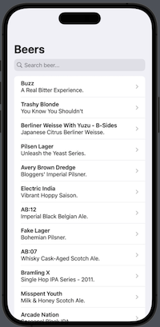
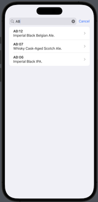
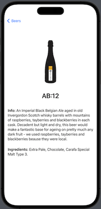

#  BeerData

<h4 align="center">A iOS app with beer info</h4>

  •<a href="#key-features">Key Features</a>
  •<a href="#how-to-use">How To Use</a> 

## Code Quality Status
 
 
 
 
  

## Key Features

* SwiftUI
* MVVM
* Async await
* Unit Test
* UI Test

## How To Use
The app help you to search beer info. It uses PunkAPI (https://punkapi.com) to display beers. Simply scroll down and select a film to read more info or use the search bar.
